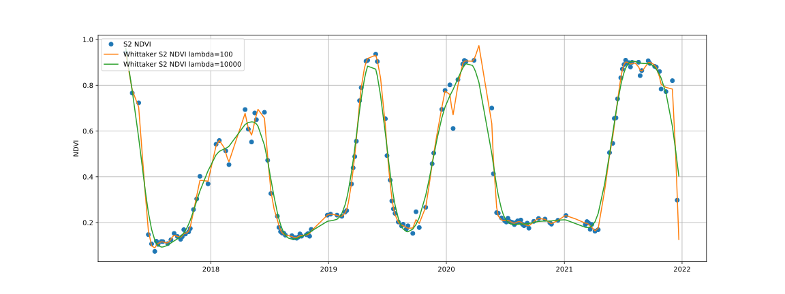

# FuseTS design

Core FuseTS algorithms are based on the [Pangeo software stack](https://pangeo.io/architecture.html#software), to maximize
interoperability with other Python libraries. More specifically, XArray Data sets and arrays are used as input and output
types throughout the library.

FuseTS consist of multiple logical modules:

- Core timeseries integration
- Timeseries analysis
- OpenEO integration

## Key design highlights

We build on the concept of EO **data cubes**, which can be small, in-memory datasets as supported by [**XArray**](https://docs.xarray.dev), or cloud-based
virtual cubes as defined by [**openEO**](https://openeo.org).

Complex algorithms are exposed as **simple Python functions** wherever possible. Simple things should be simple, complex things should be possible.

Code should be the same when working with openEO or XArray datacubes.

Prefer *[convention over configuration](https://en.wikipedia.org/wiki/Convention_over_configuration)* to allow functions 
to work with a minimal set of arguments. 


## Data cubes

Conceptually, the FuseTS library mainly works on data cubes. The openEO standard provides [a good description](https://openeo.org/documentation/1.0/datacubes.html)
of this concept in our context. When running locally, FuseTS will use XArray to represent and work on such an in-memory data cube. 

The main data object used by this library is an [Xarray DataSet](https://docs.xarray.dev/en/latest/generated/xarray.Dataset.html).
This is a self-describing data structure that combines the raw array data with metadata that describes it. This section
further documents some of the conventions that are used when working with earth observation datasets.

For building these conventions, we rely on these sources:
- https://docs.openeo.cloud/federation/backends/collections.html#bands
- https://github.com/awesome-spectral-indices/awesome-spectral-indices#expressions

The 'bands' dimension in our EO data cubes is represented by variables in the XArray dataset. This allows us to
conveniently reference them by name. Certain algorithms may expect variables with a specific name to be available, or for
the variable name to be specified. Other algorithms simply process all of the variables in dataset in the same manner.

### Dimensions

In the earth observation domain, we can standardize on a few dimensions. The FuseTS library assumes that variables share
spatiotemporal dimensions. Multiple space or time dimensions are not supported unless otherwise noted.

| Name | Description                   | Units                                               |
|------|-------------------------------|-----------------------------------------------------|
| time | The temporal dimension        | Datetime objects as numpy.datetime64                |
| x    | East-West spatial dimension   | Units of spatial reference system (meters/degrees)  |
| y    | South-North spatial dimension | Units of spatial reference system (meters/degrees)  |

When a datacube has x and y dimensions, these are assumed to be evenly spaced. The time dimension can be irregular.
Instead of regular spatial dimensions, a cube axis can also have geometries as labels. In this case, the datacube is 
assumed to contain timeseries sampled at point locations or for instance aggregated over a geometry.

An algorithm may require a specific combination of dimensions and variables to be available. 

### openEO data cubes

The methods in this library are designed to work both on openEO and XArray datacubes. This allows the user code to work 
in both cases.


## Supported EO data pipelines

The library is split up into various modules, that each try to support specific steps in a typical EO workflow.
In combination with other libraries in the Python ecosystem, it aims to address complete use cases.

### EO data loading

All use cases at some point need to read EO data for analysis. In the case of this library, this means reading it into 
an XArray Dataset that conforms to the conventions described above.

#### Loading sample data

The easiest and fastest way to get started is to load a readily available piece of sample data. 
We have some sample data available on the internet, which can be directly opened with the following line of code:

```python
import xarray, io, requests 
ds = xarray.load_dataset(io.BytesIO(requests.get("https://artifactory.vgt.vito.be/testdata-public/malawi_sentinel2.nc",stream=True).content))
```

This netCDF file already follows the necessary conventions, so should get you going quickly.

#### Loading netCDF from openEO

As there's not always sample data available for your area of interest, you'll soon wonder how to generate such a netCDF 
file yourself. One of the easiest approaches to achieve that is through a web service that supports the openEO standard.
For instance [openEO platform](https://openeo.cloud) gives you access to full archives of Copernicus and NASA data.

A netCDF file can be generated by openEO with this piece of code:
```python
import openeo
from fusets.openeo import load_cubes

spec = {
    "collections": {
        "SENTINEL2_L2A": {"bands":["B04", "B08" ]},        
    },
    "spatial_extent": [5.039291,51.166858,5.243225,51.319455],
    "temporal_extent": ("2020-01-01","2021-01-01")
}

c = openeo.connect("openeo.cloud").authenticate_oidc()
load_cubes(**spec, openeo_connection=c).execute_batch("sentinel2_bands.nc", title="FuseTS sample job")
```

#### Loading data from a STAC datacube

When your dataset is exposed through a [STAC catalog](https://stacspec.org), and uses a 'cloud-native' format like 
cloud optimized geotiffs, then it is possible to directly create an XArray based on a catalog query.

The STAC website hosts a list of [public catalogs](https://stacspec.org/en/about/datasets/#apis). 

The following code snippet shows how to achieve this. Note that it does not depend on any FuseTS functionality.

```python

from pystac_client import Client
import odc
 
mqs = Client.open("https://my.stac.catalog.eu/stac/v1")
 
search_results = mqs.search(
collections=[
"TERRASCOPE_S5P_L3_NO2_TD_V1"
],
bbox=[9.5,46.0,48.5,49.5],
max_items=4
)
 
xx = odc.stac.load(
        search_results.items(),
        bands=["NO2"],
        crs="epsg:4326",
        resolution=5000,
    )
print(xx.NO2)
```

For more information on loading data from STAC, examples can be found [here](https://odc-stac.readthedocs.io/en/latest/notebooks/stac-load-e84-aws.html).

#### Loading raw Sentinel-2 data

The hardest way to load data, is to read it from the original products. Depending on the EO product, the support in open
source tools may vary. There's also raw data products like SAR (Sentinel-1) data that requires substantial preprocessing 
to be usable.


### ARD generation

Many raw products require some level of processing to be usable. Examples include atmospheric correction for optical data, 
or computing backscatter for SAR data. 

#### Cloud masking
Many methods in this toolbox have certain assumptions about the presence of clouds in the input.
Often, some level of cloud contamination is acceptable, but it can be advisable to remove the majority of high probability
clouds early on. This has the benefit of drastically reducing the data volume.

When working with a cloud platform like openEO, you can use a built-in cloud masking method.
For a fully local workflow from raw products, we advice to use basic XArray methods to mask clouds based on quality 
information in the product.


#### Time series smoothing & interpolation
Time series smoothing methods take a single timeseries, from a pixel or aggregated over an area, and smooth it over time.
This reduces noise, and allows filling gaps by interpolating along the smoothing curve that is fitted through the observations.


```python
from fusets import whittaker
result = whittaker(timeseries_cube,smoothing_lambda=1,time_dimension="time")
```



#### Time series integration & prediction
Time series integration methods take multiple input time series and derive a variable based on that. 

MOGPR (multi-output gaussia-process regression) integrates various timeseries into a single values. This allows to
fill gaps based on other indicators that are correlated with each other.

One example is combining an optical NDVI with a SAR based RVI to compute a gap-filled NDVI. 

### Time series analysis

FuseTS aims to provide time series analysis methods specific to earth observation use cases. 

It should be noted that the broader Python ecosystem also offers capabilities that are often applicable in earth
observation:

- [scipy](https://docs.scipy.org): interpolation, fourier transforms and signal processing
- [sktime](https://www.sktime.org): time series clustering, classification and forecasting

These libraries operate mostly on NumPy data structures, making them very compatible with the XArray data structures used
here.

#### Change Detection
Change detection is provided by:
{py:class}`fusets.ccdc.ccdc_change_detection`

Additionally, integration with the Python version of BFast is foreseen in a similar manner.

#### Fitting harmonics

For fitting harmonics, for instance to predict a future value, see:

{py:class}`fusets.ccdc.fit_harmonics_curve`

#### Phenology metrics

The phenometrics implementation is based on the Phenolopy library, and is wrapped in the following FuseTS method:

{py:class}`fusets.analytics.phenology`

Computed phenometrics are shown in the figure below:


The codes presented on the figure above translate to:

Code | Name | Description | Method | 
--- | --- | --- | --- | 
POS | Peak of Season | Highest vegetation value and time of season. | Maximum value in a timeseries. |  |  
MOS | Middle of Season | Mean vegetation value and time of values in top 80% of season. | Mean value and time where the left and right slope edges have increased and decreased to the 80% level of the season, respectively. |  |
VOS | Valley of Season | Lowest vegetation value and time of season. | Minimum value in a timeseries. |  |  
BSE | Base | Mean of the lowest vegetation values in season. | Mean value of the lowest vegetation values to the left and right of Peak of Season. |  | 
SOS | Start of Season | Vegetation value and time at the start of season. | Six methods available: 1) seasonal amplitude; 2) absolute amplitude; 3) Relative amplitude; 4) LOESS STL Trend line; 5) First value of positive slope; and 6) Median value of positive slope. |  |  
EOS | End of season | Vegetation value and time at the end of season. | Six methods available: 1) seasonal amplitude; 2) absolute amplitude; 3) Relative amplitude; 4) LOESS STL Trend line; 5) First value of negative slope; and 6) Median value of negative slope. |  |  
LOS | Length of Season | Length of time (number of days) between the start and end of season. | The day of year at SOS minus EOS. | |  
ROI | Rate of Increase | The rate of vegetation "green up" at the beginning of season. | Calculated as the ratio of the difference between the left 20% and 80% levels and the corresponding time difference. |  | 
ROD | Rate of Decrease | The rate of vegetation "green down" at the end of season. | Calculated as the ratio of the difference between the right 20% and 80% levels and the corresponding time difference. |  | 
AOS | Amplitude of Season | The amplitude of vegetation values for season. | The difference between the maximum value and the VOS/BSE value. |  | 
SIOS | Short Integral of Season | Represents the seasonally active vegetation and provides a larger value for herbaceous vegetation cover and smaller value for evergreen vegetation cover. | Calculated using the trapezoidal rule on the total vegetation values between season start and end minus the VOS/BSE level value. |  | 
LIOS | Long Integral of Season | Represents the total productivity of vegetation when in season. | Calculated using the trapezoidal rule between the total vegetation values between season start and end. |  | 
SIOT | Short Integral of Total | Represents total vegetation productivity throughout the season, and provides a larger value for herbaceous vegetation cover and smaller value for evergreen vegetation cover. | Calculated using the trapezoidal rule on the total vegetation values minus the VOS/BSE level value. |  | 
LIOT | Long Integral of Total | Represents the total productivity of vegetation throughout the season. | Calculated using the trapezoidal rule between the total vegetation values between season start and end. |  | 
NOS | Number of Seasons | Total number of seasons (i.e. prominent graph peaks) in timerseries. | Peaks detected using scipy find_peaks and any peaks are over 3 months apart. | | 


